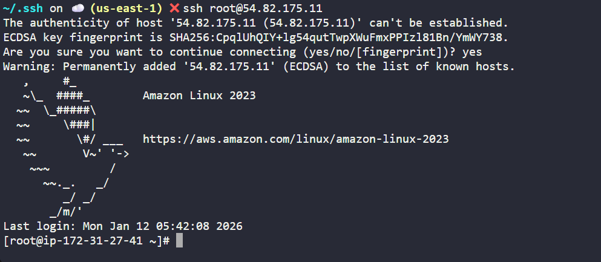

# Day 22 – Configuring Secure SSH Access to an EC2 Instance

## Task / Requirement
The Nautilus DevOps team needs to set up a new EC2 instance that can be accessed securely from the landing host (`aws-client`)
without using password-based authentication.

Since no SSH keys were present on the landing host, a new SSH key pair must be created and configured during EC2 launch
to allow passwordless SSH access.

**Requirement details:**
- AWS Service: EC2
- EC2 Instance Name: nautilus-ec2
- Instance Type: t2.micro
- Landing Host: aws-client
- SSH Key Location (Client): /root/.ssh/
- Goal: Enable passwordless SSH access using SSH keys

---

## Steps Performed
- Logged into the landing host **aws-client**
- Verified that no SSH keys existed under `/root/.ssh/`
- Generated a new SSH key pair using `ssh-keygen`
- Copied the public key content from the landing host
- Launched a new EC2 instance named **nautilus-ec2**
- Used **user data** during EC2 launch to add the public key to the root user's `authorized_keys`
- Completed EC2 instance creation
- Verified that the EC2 instance initialization was completed
- Tested SSH access from the landing host to the EC2 instance using `ssh root@<ec2-ip>`
- Confirmed successful passwordless SSH login

---

## Learnings / Key Takeaways
- SSH keys must exist on the client machine before configuring passwordless access
- `ssh-keygen` is used to generate secure SSH key pairs
- User data can be used during EC2 launch to automate initial configuration
- Configuring SSH access at launch avoids manual post-setup steps
