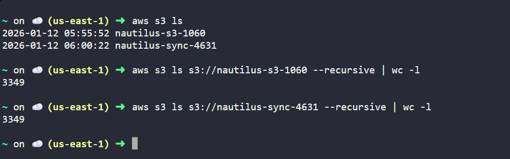

# Day 23 – Data Migration Between S3 Buckets Using AWS CLI

## Task / Requirement
As part of a data migration activity, the Nautilus DevOps team needs to migrate data from an existing S3 bucket to a new S3 bucket.
The migration must ensure that all objects are copied accurately without any data loss.

The task is to create a new private S3 bucket and migrate the entire data from the source bucket using AWS CLI,
followed by verification to ensure data consistency.

**Requirement details:**
- AWS Service: S3
- Source Bucket: nautilus-s3-1060
- Destination Bucket: nautilus-sync-4631
- Bucket Type: Private
- Tool Used: AWS CLI
- Goal: Migrate data and verify both buckets contain the same data

---

## Steps Performed
- Verified AWS CLI access and permissions
- Created a new private S3 bucket using AWS CLI
- Synced all objects from the source bucket to the destination bucket
- Verified object count in both buckets
- Compared total size and object summary of both buckets to ensure data consistency.
  The comparison output is captured in the screenshot below.



- Performed a dry run sync to confirm no pending differences

### Commands Used
```bash
# Create new S3 bucket
aws s3 mb s3://nautilus-sync-4631

# Sync data from source to destination bucket
aws s3 sync s3://nautilus-s3-1060 s3://nautilus-sync-4631

# Compare object count in both buckets
aws s3 ls s3://nautilus-s3-1060 --recursive | wc -l
aws s3 ls s3://nautilus-sync-4631 --recursive | wc -l

# Compare object size summary
aws s3 ls s3://nautilus-s3-1060 --recursive --summarize
aws s3 ls s3://nautilus-sync-4631 --recursive --summarize

# Dry run to verify no pending changes
aws s3 sync s3://nautilus-s3-1060 s3://nautilus-sync-4631 --dryrun
```

---

## Learnings / Key Takeaways
- `aws s3 cp` copies objects as-is every time it is run, while `aws s3 sync` copies only new or modified objects, making `sync` more efficient for repeated or large-scale migrations
- Object count comparison helps quickly validate migration completeness
- Using `--summarize` allows verification of total object size between buckets
- `--dryrun` is useful to confirm that no pending changes remain after migration
- AWS CLI enables repeatable and scriptable S3 migration workflows
