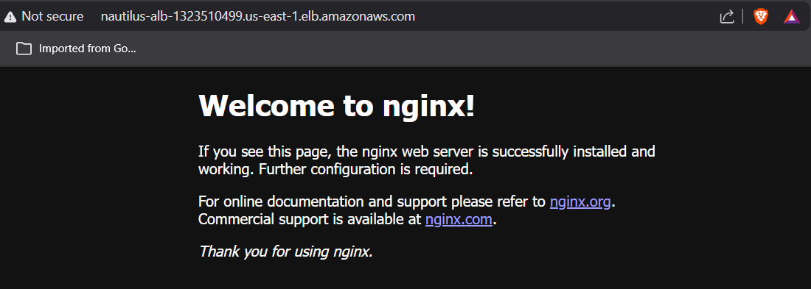

# Day 24 – Setting Up an Application Load Balancer for an EC2 Instance

## Task / Requirement
The Nautilus DevOps team needs to expose an application running on an EC2 instance using an Application Load Balancer (ALB).
An Nginx server is already running on the EC2 instance and serving a sample page.

The task is to configure an ALB to route HTTP traffic to the EC2 instance securely and correctly.

**Requirement details:**
- AWS Service: EC2 / Application Load Balancer
- Load Balancer Name: nautilus-alb
- Target Group Name: nautilus-tg
- Security Group Name: nautilus-sg
- Listener Port: 80
- Target Port: 80
- EC2 Instance: nautilus-ec2
- Goal: Route HTTP traffic from ALB to EC2 instance

---

## Steps Performed
- Logged into the AWS Management Console
- Navigated to **EC2 → Target Groups**
- Created a target group named **nautilus-tg**
- Set target type as **Instance**
- Configured protocol **HTTP** and port **80**
- Registered the EC2 instance **nautilus-ec2** as a target
- Navigated to **EC2 → Security Groups**
- Created a new security group **nautilus-sg**
- Allowed inbound HTTP traffic on port **80** from the public i.e 0.0.0.0/0
- Navigated to **EC2 → Load Balancers**
- Created an **Application Load Balancer** named **nautilus-alb**
- Attached the security group **nautilus-sg** to the ALB
- Configured the listener to forward traffic to **nautilus-tg**
- Updated the EC2 instance security group to allow inbound traffic from the ALB
- Verified that accessing the ALB DNS name returned the Nginx sample page.

---

## Learnings / Key Takeaways
- Application Load Balancers operate at Layer 7 and route traffic based on HTTP rules
- Target groups define backend destinations and health check configuration
- ALB security groups control public access, while EC2 security groups control backend access
- EC2 instances must explicitly allow inbound traffic from the ALB security group
- ALB DNS name is the only supported way to access the load balancer; static IPs are not provided
- Health checks determine whether traffic is forwarded; unhealthy targets receive no traffic
- ALB automatically distributes traffic across healthy targets in multiple Availability Zones
- Listener rules control how incoming requests are routed to target groups
- Using security group references between ALB and EC2 is more secure than exposing EC2 directly to the internet
- Using an ALB improves scalability, availability, and decouples clients from backend instances

