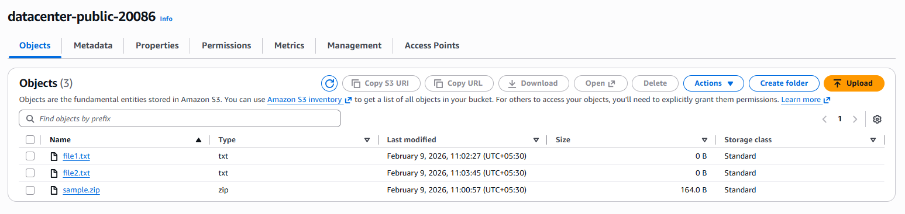
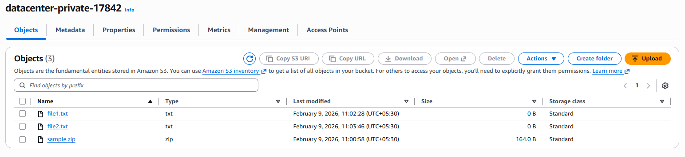
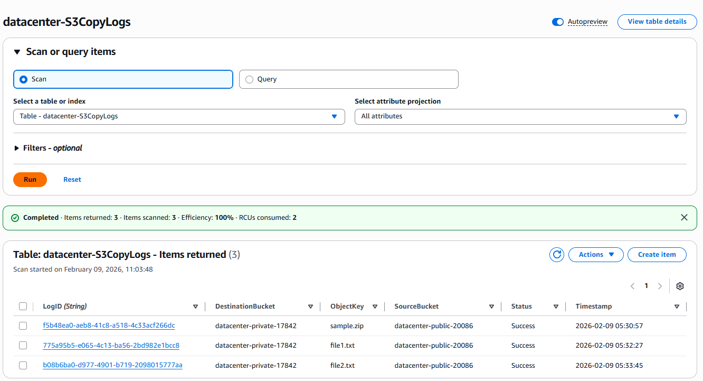

# Day 46 – Event-Driven Processing with Amazon S3 and Lambda

## Task / Requirement
The Nautilus DevOps team needs to automate file handling between two S3 buckets using an event-driven
architecture. Whenever a file is uploaded to a public S3 bucket, a Lambda function should be triggered
to copy the file to a private S3 bucket. Additionally, each file transfer must be logged in DynamoDB
for auditing and visibility.

The task involves configuring S3 buckets, Lambda, IAM roles and policies, DynamoDB, and event triggers.

**Requirement details:**
- AWS Services: S3 / Lambda / DynamoDB / IAM / CloudWatch
- Public S3 Bucket: devops-public-5607
- Private S3 Bucket: devops-private-28593
- Lambda Function: devops-copyfunction
- DynamoDB Table: devops-S3CopyLogs
- Partition Key: LogID (String)
- Goal: Automatically copy uploaded files and log the operation

---

## Steps Performed

### S3 Bucket Configuration
- Created a **public S3 bucket** named **devops-public-5607**
- Allowed public access to objects in the public bucket
- Created a **private S3 bucket** named **devops-private-28593**
- Ensured public access was blocked for the private bucket

---

### DynamoDB Table Setup
- Created a DynamoDB table named **devops-S3CopyLogs**
- Configured the partition key:
  - `LogID` (String)
- Used default capacity and settings

---

### IAM Role and Policies
- Created an IAM role named **lambda_execution_role**
- Attached required policies:
  - AmazonS3FullAccess
  - DynamoDB access policy (for PutItem)
  - Default AWS Lambda execution role
- Ensured the role had permissions to:
  - Read objects from the public S3 bucket
  - Write objects to the private S3 bucket
  - Insert log entries into DynamoDB
  - Write logs to CloudWatch

---

### Lambda Function Setup
- Created a Lambda function named **devops-copyfunction**
- Attached the **lambda_execution_role**
- Used the existing `lambda-function.py` from `/root/`
- Updated the code to replace:
  - `REPLACE-WITH-YOUR-DYNAMODB-TABLE` → `devops-S3CopyLogs`
  - `REPLACE-WITH-YOUR-PRIVATE-BUCKET` → `devops-private-28593`
- Verified CloudWatch log group creation for the Lambda function

---

### S3 Event Trigger Configuration
- Configured an **S3 PUT event trigger** on the public bucket
- Set the trigger to invoke **devops-copyfunction** whenever a file is uploaded

---

### Verification
- Uploaded `sample.zip` from the aws-client host to the public S3 bucket: `aws s3 cp /root/sample.zip s3://devops-public-5607/`

### Verified that:
- Lambda function was triggered successfully
- File was copied to devops-private-28593
- A log entry was created in devops-S3CopyLogs with:
    - Source bucket
    - Destination bucket
    - Object key
- Confirmed Lambda execution and logs in CloudWatch

**Objects Uploaded to the Public S3**

**Objects copied to the Private S3**

**Objects Uploaded & Copied are logged to the DynamoDB**

---

## Learnings / Key Takeaways
- Amazon S3 can trigger Lambda functions based on object-level events
- Event-driven architectures eliminate the need for manual or scheduled processing
- Lambda functions can integrate multiple AWS services in a single workflow
- DynamoDB is effective for storing lightweight operational logs
- IAM roles and least-privilege permissions are critical for secure automation
- CloudWatch logs are essential for debugging and monitoring Lambda executions
